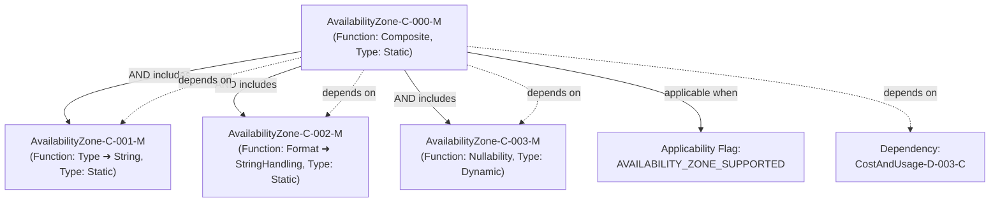

### Availability Zone

```mermaid
graph TD
    %% ===== Nodes =====
    R0["AvailabilityZone-C-000-M<br/>(Function: Composite, Type: Static)"]
    R1["AvailabilityZone-C-001-M<br/>(Function: Type ➜ String, Type: Static)"]
    R2["AvailabilityZone-C-002-M<br/>(Function: Format ➜ StringHandling, Type: Static)"]
    R3["AvailabilityZone-C-003-M<br/>(Function: Nullability, Type: Dynamic)"]

    AC["Applicability Flag:<br/>AVAILABILITY_ZONE_SUPPORTED"]
    DS["Dependency:<br/>CostAndUsage-D-003-C"]

    %% ===== Relationships =====
    %% Composite includes three rules via AND
    R0 -->|"AND includes"| R1
    R0 -->|"AND includes"| R2
    R0 -->|"AND includes"| R3

    %% Applicability (the composite is only relevant when this flag is true)
    R0 -->|"applicable when"| AC

    %% Dependencies (explicit list under ValidationCriteria.Dependencies)
    R0 -. "depends on" .-> DS
    R0 -. "depends on" .-> R1
    R0 -. "depends on" .-> R2
    R0 -. "depends on" .-> R3
```
