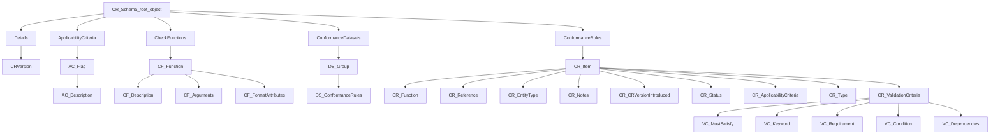

### DAG Diagram

```mermaid
graph TD
    Root[CR_Schema_root_object] --> Details
    Root --> ApplicabilityCriteria
    Root --> CheckFunctions
    Root --> ConformanceDatasets
    Root --> ConformanceRules

    Details --> CRVersion

    ApplicabilityCriteria --> AC_Flag
    AC_Flag --> AC_Description

    CheckFunctions --> CF_Function
    CF_Function --> CF_Description
    CF_Function --> CF_Arguments
    CF_Function --> CF_FormatAttributes

    ConformanceDatasets --> DS_Group
    DS_Group --> DS_ConformanceRules

    ConformanceRules --> CR_Item
    CR_Item --> CR_Function
    CR_Item --> CR_Reference
    CR_Item --> CR_EntityType
    CR_Item --> CR_Notes
    CR_Item --> CR_CRVersionIntroduced
    CR_Item --> CR_Status
    CR_Item --> CR_ApplicabilityCriteria
    CR_Item --> CR_Type
    CR_Item --> CR_ValidationCriteria

    CR_ValidationCriteria --> VC_MustSatisfy
    CR_ValidationCriteria --> VC_Keyword
    CR_ValidationCriteria --> VC_Requirement
    CR_ValidationCriteria --> VC_Condition
    CR_ValidationCriteria --> VC_Dependencies
```
